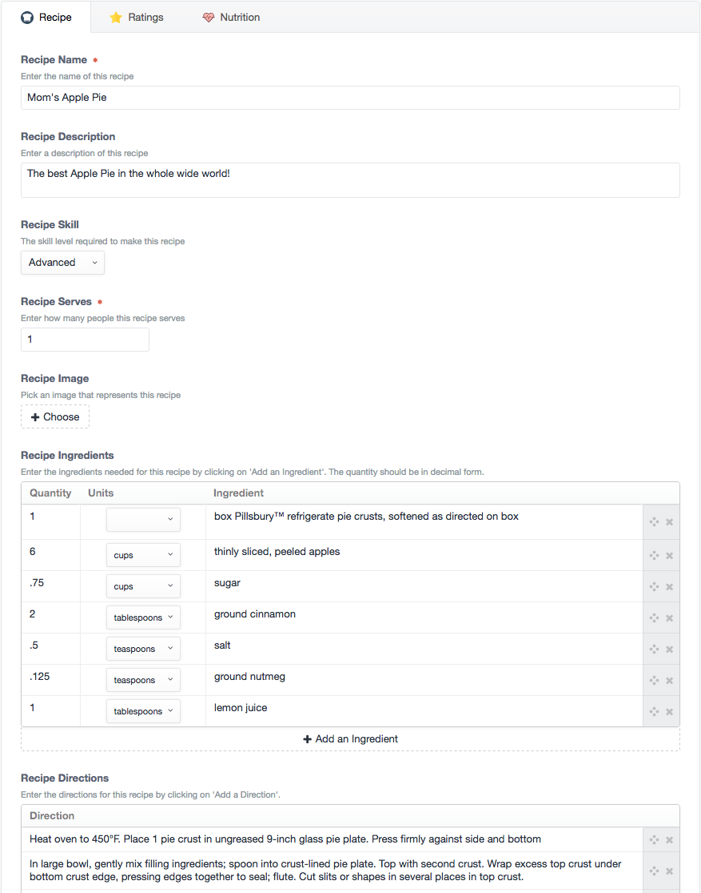
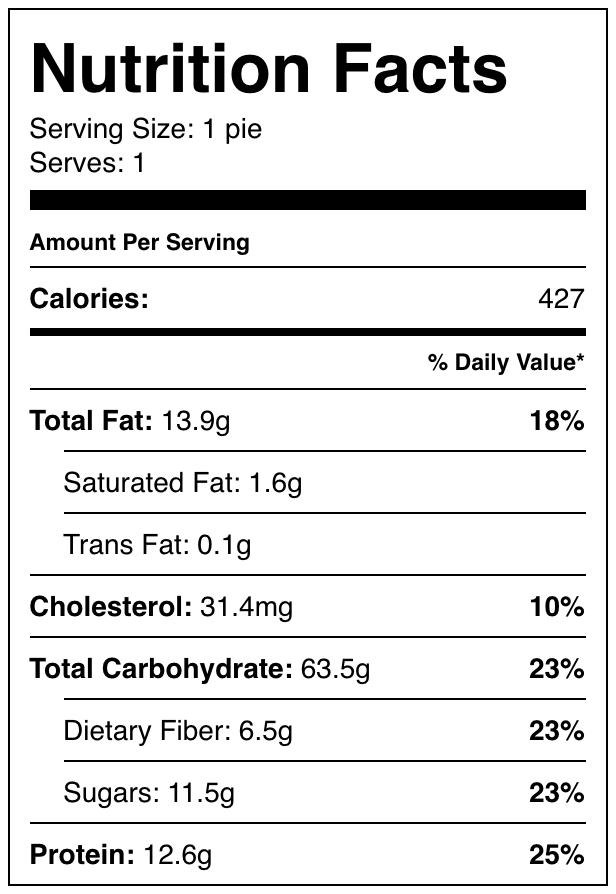

[](https://scrutinizer-ci.com/g/nystudio107/craft-recipe/?branch=v1) [](https://scrutinizer-ci.com/g/nystudio107/craft-recipe/?branch=v1) [](https://scrutinizer-ci.com/g/nystudio107/craft-recipe/build-status/v1) [](https://scrutinizer-ci.com/code-intelligence)

# Recipe plugin for Craft CMS 3.x

A comprehensive recipe FieldType for Craft CMS that includes metric/imperial conversion, portion calculation, and JSON-LD microdata support


Related: [Recipe for Craft 2.x](https://github.com/nystudio107/recipe)

## Requirements

This plugin requires Craft CMS 3.0.0 or later.

## Installation

To install Recipe, follow these steps:

1. Install with Composer via `composer require nystudio107/craft-recipe`
2. Install the plugin via `./craft install/plugin recipe` via the CLI, or in the Control Panel, go to Settings → Plugins and click the “Install” button for Recipe.

You can also install Recipe via the **Plugin Store** in the Craft AdminCP.

Recipe works on Craft 3.x.

## Recipe Overview



Recipe adds a 'Recipe' FieldType for Craft CMS that you can add to any of your Sections.

In encapsulates everything you need for a recipe, including the ingredients, a photo of the recipe, directions, cooking time, ratings, and even nutritional information. It handles converting between Imperial and Metric units, outputs 'pretty' fractions for Imperial units, and can output correct ingredient portions for any number of servings.

Recipe also generates the [JSON-LD microdata](https://developers.google.com/structured-data/) for your recipes, which allows it to be displayed in the [Google knowledge panel](https://developers.google.com/structured-data/rich-snippets/recipes) for search results.

We hope Recipe makes it easier for you to create and share some yummy recipes!

## Configuring Recipe

Create a Recipe field via **Settings->Fields** and you can set the Asset Sources that are used for the recipe images

## Using Recipe

Once you have created the Recipe field, add it to your Section Entry Types, and fill in what recipe information is appropriate.  Nothing other than the name is required, so feel free to leave anything blank that you're not using.

## Using Recipe in your Templates

To display information about a recipe in your templates, you just use familiar Twig code.  Let's assume the field handle for your Recipe field is `someRecipe`; this is what you'd use to output information about it:

### Basic Info

* `entry.someRecipe.name` - the name of the recipe
* `entry.someRecipe.description` - the description of the recipe
* `entry.someRecipe.skill` - the skill level required to make this recipe
* `entry.someRecipe.serves` - how many people the recipe serves
* `entry.someRecipe.getImageUrl()` - a URL to the image for the recipe; you can pass in an optional image transform or image transform handle here as well: `entry.someRecipe.getImageUrl('display')`
* `entry.someRecipe.prepTime` - the prep time for the recipe in minutes
* `entry.someRecipe.cookTime` - the cooking time for the recipe in minutes
* `entry.someRecipe.totalTime` - the total time for the recipe in minutes

### Nutritional Facts

For a nutrition facts label, you can use:

```twig
{{ entry.someRecipe.renderNutritionFacts() }}
```

Which will output a responsive nutrition facts label embed based on the data in the Nutrition tab:



The percentages are based on [US Recommended Dietary Allowances](https://en.wikipedia.org/wiki/Reference_Daily_Intake), but you can pass in your own values as well:

```twig
{{ entry.someRecipe.renderNutritionFacts({
    'calories': 2000,
    'carbohydrateContent': 275,
    'cholesterolContent': 300,
    'fatContent': 78,
    'fiberContent': 28,
    'proteinContent': 50,
    'saturatedFatContent': 20,
    'sodiumContent': 2300,
    'sugarContent': 50,
}) }}
```

If you want to control the way the template looks, you can put your own frontend template in `recipe/recipe-nutrition-facts` and Recipe will use it

### Ingredients

For a list of ingredients, do the following (adding whatever output markup you want):

```twig
    
    
        {{ ingredient }}
    
```

The first parameter is the units you'd like to use (`'imperial'` or `'metric'`).  The second parameter is how many people you'd like the recipe portions to be sized for.  By default, it will use `'imperial'` and the serving size in the recipe if you don't pass these parameters in, e.g.: `entry.someRecipe.getIngredients()`

### Directions

For a list of directions, do the following (adding whatever output markup you want):

```twig
    
    
        {{ direction }}
    
```

### Ratings

For a list of the ratings, do the following (adding whatever output markup you want):

```twig
    
    
        {{ rating.rating }} {{ rating.review }} {{ rating.author }}
    
```

For the aggregate (average) rating for this recipe, do the following (adding whatever output markup you want):

```twig
   {{ entry.someRecipe.getAggregateRating() }}
```

### Nutritional Information 

To output the nutritional information for the recipe, do the following:

* `entry.someRecipe.servingSize` - The serving size, in terms of the number of volume or mass
* `entry.someRecipe.calories` - The number of calories per serving
* `entry.someRecipe.carbohydrateContent` - The number of grams of carbohydrates per serving
* `entry.someRecipe.cholesterolContent` - The number of milligrams of cholesterol per serving
* `entry.someRecipe.fatContent` - The number of grams of fat per serving
* `entry.someRecipe.fiberContent` - The number of grams of fiber per serving
* `entry.someRecipe.proteinContent` - The number of grams of protein per serving
* `entry.someRecipe.saturatedFatContent` - The number of grams of saturated fat per serving
* `entry.someRecipe.sodiumContent` - The number of milligrams of sodium per serving
* `entry.someRecipe.sugarContent` - The number of grams of sugar per serving
* `entry.someRecipe.transFatContent` - The number of grams of trans fat per serving
* `entry.someRecipe.unsaturatedFatContent` - The number of grams of unsaturated fat per serving

### Image Asset ID

If you need to do any further manipulation of the Recipe Image (perhaps a transform) you can get the Asset ID for it:

* `entry.someRecipe.imageId` - the Asset ID of the image for the recipe

## Rendering Recipe JSON-LD Microdata

Recipe can render JSON-LD microdata for you, which allows it to be displayed in the [Google knowledge panel](https://developers.google.com/structured-data/rich-snippets/recipes) for search results:

```twig
	{{ entry.someRecipe.renderRecipeJSONLD() }}
```


## Importing Recipes with Feed Me

Recipes can be imported using the first-party [Feed Me](https://plugins.craftcms.com/feed-me) plugin by Pixel & Tonic. Ingredients, directions and ratings can be repeated as shown below.

### XML

```xml
<Recipe>
    <Name>Dough</Name>
    <Description>Simple dough recipe.</Description>
    <Ingredients>
        <Row>
            <Quantity>1</Quantity>
            <Units>cups</Units>
            <Ingredient>Lukewarm water</Ingredient>
        </Row>
        <Row>
            <Quantity>0.5</Quantity>
            <Units>cups</Units>
            <Ingredient>Unsalted butter</Ingredient>
        </Row>
        <Row>
            <Quantity>2</Quantity>
            <Units>cups</Units>
            <Ingredient>Flour</Ingredient>
        </Row>
    </Ingredients>
    <Directions>
        <Row>
            <Direction>Mix and stir.</Direction>
        </Row>
    </Directions>
    <Reviews>
        <Row>
            <Rating>5</Rating>
            <Review>Works a charm.</Review>
            <Author>Arthur</Author>
        </Row>
        <Row>
            <Rating>3</Rating>
            <Review>It's just dough.</Review>
            <Author>Alice</Author>
        </Row>
    </Reviews>
</Recipe>
```

### JSON

```json
{
    "Recipe": {
        "Name": "Recipe #1",
        "Description": "Simple dough recipe.",
        "Ingredients": [
            {
                "Quantity": 1,
                "Units": "cups",
                "Ingredient": "Lukewarm water"
            },
            {
                "Quantity": 0.5,
                "Units": "cups",
                "Ingredient": "Unsalted butter"
            },
            {
                "Quantity": 2,
                "Units": "cups",
                "Ingredient": "Flour"
            }
        ],
        "Directions": [
            {
                "Direction": "Mix and stir."
            }
        ],
        "Ratings": [
            {
                "Rating": 5,
                "Review": "Works a charm.",
                "Author": "Arthur"
            },
            {
                "Rating": 3,
                "Review": "It's just dough.",
                "Author": "Alice"
            }
        ]
    }
}
```

## Fetching Nutritional Information from an API

Nutritional information for recipe ingredients can be fetched in the Nutrition tab using the [Edamam Nutrition Analysis API](https://developer.edamam.com/edamam-nutrition-api). You must first get an API application ID and key and enter them in the plugin settings. A `Fetch Nutritional Information` button will then appear in the `Nutrition` tab of the recipe field.


A console command to generate nutritional information from the API for all entries in a specific section is also available.

```sh
./craft recipe/nutrition-api/generate --section=recipes --field=recipe
```

Both the `section` (section handle) and `field` (recipe field handle) options are required. Note that this command will overwrite the nutritional information for _every_ entry in the given section.


Brought to you by [nystudio107](https://nystudio107.com)
